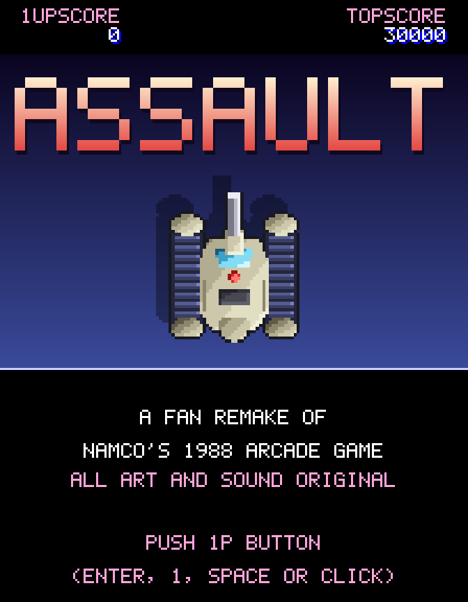
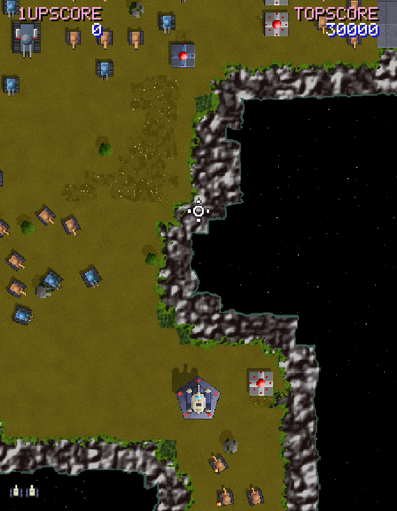
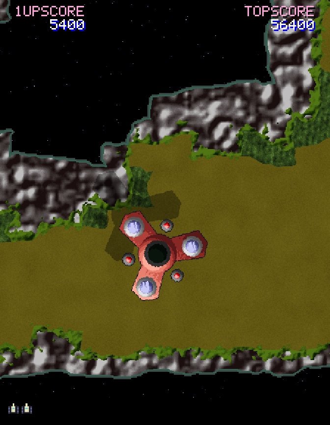

# Assault (fan remake)

A browser-based fan remake of Namco's 1988 arcade tank shooter *Assault*, built
with TypeScript and [Phaser 3](https://phaser.io/). It runs in any modern browser
on Windows, macOS and Linux.

All art and sound are original and drawn procedurally. The files in `reference/`
are drawing reference only and are never loaded by the game. The full design and
requirements are in [`docs/DESIGN.md`](docs/DESIGN.md).

| Title screen | Raised on a jump zone | A Generator overhead |
| :---: | :---: | :---: |
|  |  |  |

## Running it

Needs Node.js 20.19+ (22 LTS recommended) and **npm 11+**. npm 10.9 has a bug
that breaks installing Vitest; run `npx npm@11 install` if `npm -v` shows 10.x.

```sh
npm install
npm run dev        # play at http://localhost:5173
npm test           # unit tests
npm run build      # typecheck + production build in dist/
npm run smoke      # after a build: drives the game in headless Chromium, saves screenshots
npm run art        # renders sprites/terrain/font to smoke-output/art/ for inspection
```

## Controls

**Arrow keys (easiest on a keyboard):**

| Keys | Move |
|---|---|
| ↑ / ↓ | Drive forward / reverse |
| ← / → | Turn left / right; hold with ↑ or ↓ to steer while driving |
| ← + → together | Wheelie: the tank rears up and a crosshair slides out; fire launches a nuke |
| Double-tap ← or → | Roll (flip over sideways) that way |
| Space | Fire |

**Arcade twin levers:** the original cabinet had two 4-way levers, one per hand.
Here the left lever is **WASD** and the right lever is **IJKL**:

| Left lever | Right lever | Keys | Move |
|---|---|---|---|
| ↑ | ↑ | W + I | Forward |
| ↓ | ↓ | S + K | Back |
| ↓ | ↑ | S + I | Turn left |
| ↑ | ↓ | W + K | Turn right |
| ← | ← | A + J | Roll left (flip over sideways) |
| → | → | D + L | Roll right |
| ← | → | A + L | Wheelie |
| ↑ | – | W | Arc forward, curving right (one track drives) |
| – | ↑ | I | Arc forward, curving left |
| ↓ | – | S | Arc backward, swinging left |
| – | ↓ | K | Arc backward, swinging right |

Both schemes work at the same time. **Space** fires: tap or hold. At most three
shots can be on screen, and they burst against cliffs. You can fire while
rolling. During a wheelie a crosshair slides out from the tank, white while
extending and red at full range (120 px). Fire lobs a nuke over obstacles to
wherever the crosshair is, so fire early for a short lob. The nuke then needs
2.5 s to recharge. **M** mutes the sound. In dev builds, **`** (backquote)
toggles a readout of the levers, the current move and the nuke recharge.

**Enter**, **1**, **Space** or a click starts a game from the title screen. URL
options for testing: `?play` skips the title, `?stage=N` starts at stage N,
`?map=test` plays the proving-ground map, and `?peaceful` removes the enemies.

## Layout

```
src/input/     lever + maneuver logic (pure) and keyboard adapter
src/sim/       tank movement, weapons, terrain and collision (pure, unit-tested)
src/art/       palette, pixel-art sprites, pixel font, terrain and explosion renderers
src/audio/     synthesised retro sound effects (Web Audio, no sample files)
src/scenes/    Phaser scenes: boot (textures), game (world + rotating camera), HUD
src/stages/    map data
tests/         Vitest unit tests
scripts/       smoke test and art preview tools
reference/     original screenshots/sprites for drawing reference (not shipped)
```

## Status

- **Milestone 1 (done):** the two-lever controls, and the tank driving,
  turning, rolling and wheelieing on a test map while the world rotates around it.
- **Milestone 2 (done):** regular shots (three on screen at most), wheelie
  nukes with arc, blast radius and recharge, explosions, and sound effects.
- **Milestone 3 (done):** enemies on the test map (Type 1, 2 and 5 tanks, four-
  and eight-way pillboxes, triple-barrel cannons). They wake as you approach,
  close in from the flanks and fire orange shots, pink shots or homing
  missiles; you can shoot missiles down. Enemies take hits as on StrategyWiki
  and award its points. Nukes damage everything in the blast. Wrecked tanks
  leave craters that slow you. One hit kills you ("YOU WERE HIT"); you get
  three lives, an extra life at 20,000 points, and a fresh game after GAME OVER.
- **Milestone 4 (done):** stage 1, "Progress Planetary Circumstances". The
  F-shaped terrain is converted from StrategyWiki's map of the original, and the
  waves follow its walkthrough. It has the bends of light tanks, the 8-way pillbox
  and jump zone, the big field of tanks, the pillbox run, and two cannons guarding
  the base. Also included:
  - PLAYER 1 READY, a 2:15 clock that shows under 100 s and flashes red, and TIME UP.
  - Jump zones that raise the tank with a zoomed-out view and longer nukes,
    with no recharge. They wake every enemy in view, and each works 3 times.
  - The guide arrow, STAGE CLEAR, the time bonus (50 points per second), and
    the hatch exit.
  - The title screen with the high-score table, and name entry saved in the
    browser.
- **Milestone 5 (done):** stage 2, "Memorial Land Forever". The terrain is
  converted directly from StrategyWiki's map of the original (ponds, crop fields,
  rough ground, two jump zones, the cannon battery and hatch strip). The waves
  follow the walkthrough: each tank group, once destroyed, raises nuke-only UFO
  launchers from holes in the ground, which fire lasers. Also adds Type 3 tanks,
  a parked tank worth 1000 points, and the 2:40 clock. The player tank is
  redrawn with the original's single central cannon.
- **Milestone 6 (done):** area 3, "Crops Grow in River Side", stages 3-5. All
  three play on crops of one map converted from StrategyWiki's area map, with
  hand-built bases, cannon batteries and hedge rows. Stages 3 and 4 end at gates
  that slide open, and the tank drives through into the next stage. Stage 5
  (6:00) ends on a launch pad. New enemies:
  - armoured Type 1s, the 101 Scouter, and Type 6, 7-A and 7-B heavy tanks (the
    7-B fires in sixteen directions);
  - Type 4s that surface from the rivers;
  - hovering 501 Fourlegs that fly over cliffs and the void;
  - the airborne Generator: shells pass beneath it, each nuke is one hit, and a
    nuke down its centre hole destroys it outright;
  - Type 2 and Type 3 cannons.
- **Next:** area 4, "And Reconstruct Our Ruined Home" (stages 6-9 and 11), then
  stage 10 on the area 3 map.
